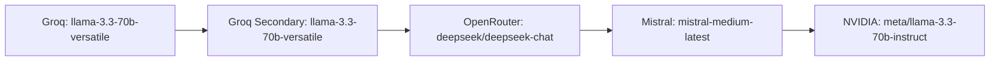
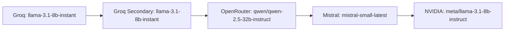
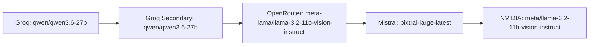
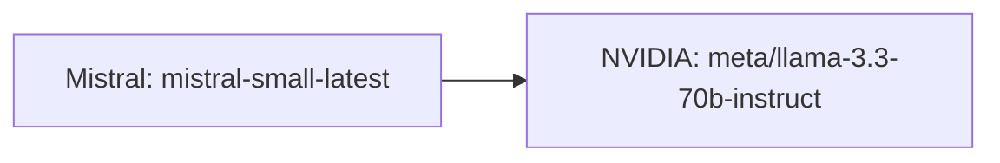

# BRAUDLE AI Gateway & Fallback Model Architecture

This document describes the structure, providers, models, and fallback routing logic of the central AI Gateway in the BRAUDLE backend.

---

## 1. Gateway Overview

To ensure high availability and prevent single-point-of-failure (SPOF) downtime, the BRAUDLE AI Gateway uses an automated, multi-provider fallback routing mechanism. If a provider times out, returns a 500 error, or is rate-limited (429), the gateway shifts to the next provider in the chain without interrupting the student's study session.

---

## 2. Active AI Providers (Services)

The AI Gateway integrates with **4 external API providers** configured as **5 active credentials** via environment variables:

| Provider Key | External Service | Role / Position | API Key Source |
| :--- | :--- | :--- | :--- |
| `groq` | Groq | Primary Provider | `GROQ_API_KEY_1` |
| `groq_secondary` | Groq Secondary | Backup Provider (Same API, separate quota) | `GROQ_API_KEY_2` |
| `openrouter` | OpenRouter | First Alternate Provider | `OPENROUTER_API_KEY` |
| `mistral` | Mistral AI | Second Alternate Provider | `MISTRAL_API_KEY` |
| `nvidia` | NVIDIA API Catalog | Third Alternate Provider | `NVIDIA_API_KEY` |

> [!NOTE]
> `gemini` is configured in `env.js` but is not currently registered in the active fallback arrays of the `ai.service.js` gateway.

---

## 3. Fallback Model Matrices

Models are selected based on the specific **Task Type** to balance accuracy, features (like Vision), and execution speed.

### 3.1 Tutoring Task (`tutoring`)
Used for core student teaching, inline explanations, and misconceptions corrections.

### 3.2 Analysis Task (`analysis`)
Used for fast metadata extractions, checks, session analyses, and grading.

### 3.3 Vision Task (`vision`)
Used for transcribing handwritten notes or diagrams from uploaded images.

### 3.4 General Chat Task (`general_chat`)
Used for general conversational interactions. Note that it skips the Groq keys to preserve quotas for tutoring.

---

## 4. Summary Table of Models & Fallbacks

| Task Type | Primary Model (Groq) | Fallback 1 (OpenRouter) | Fallback 2 (Mistral) | Fallback 3 (NVIDIA) |
| :--- | :--- | :--- | :--- | :--- |
| **`tutoring`** | `llama-3.3-70b-versatile` | `deepseek/deepseek-chat` (DeepSeek V3) | `mistral-medium-latest` | `meta/llama-3.3-70b-instruct` |
| **`analysis`** | `llama-3.1-8b-instant` | `qwen/qwen-2.5-32b-instruct` | `mistral-small-latest` | `meta/llama-3.1-8b-instruct` |
| **`vision`** | `qwen/qwen3.6-27b` | `meta-llama/llama-3.2-11b-vision-instruct` | `pixtral-large-latest` | `meta/llama-3.2-11b-vision-instruct` |
| **`general_chat`**| *N/A (Bypassed)* | *N/A (Bypassed)* | `mistral-small-latest` (Primary) | `meta/llama-3.3-70b-instruct` (Fallback) |

---

## 5. Gateway Execution Rules
1. **Transient vs. Non-Transient Checks**: If a provider returns authentication errors (`401`, `403`) or invalid requests (`400`), the gateway aborts immediately and throws the error. Fallbacks are only triggered for network timeouts, `429` (Rate limits), or `5xx` (Server errors).
2. **Timeout Enforcement**: Every request uses a 30-second AbortController signal timeout. If a provider fails to respond in 30 seconds, it is marked as a timeout and the next provider is called.
3. **Embeddings & Fallbacks**: Embeddings target `openai/text-embedding-3-small` via OpenRouter. If OpenRouter fails, the gateway degrades to local term-hash based TF-IDF vectors (`getLocalTfidfEmbedding`), ensuring zero-cost offline resiliency.
