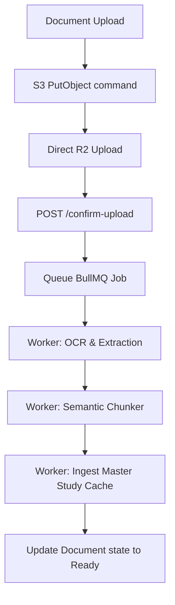

# BRAUDLE Full System Codebase & Architecture Audit

This document serves as the absolute technical reference for the entire BRAUDLE full-stack architecture, detailing the configuration, directories, routing, hooks, schemas, background workers, AI engines, and optimization protocols.

---

## 📂 1. Directory Structure & File Map

BRAUDLE is built as a split full-stack application (Next.js 16 frontend and Express.js backend). The codebase is clean, modular, and does not run any Python code.

### 1.1 Frontend Layout (`braudle-frontend`)
*   **`app/`**: Contain App Router segments.
    *   **`(auth)/login/`**: Core dark-themed entry route. Uses a passwordless email magic link pattern and Google OAuth.
    *   **`onboarding/`**: Collects the student's study goals, study levels, and styles, writing to the backend `/api/profile/setup`.
    *   **`dashboard/`**: The light-themed study canvas hub. Includes the upload zones and polls the background ingestion status.
    *   **`session/[id]/`**: The main study page where the student interacts with the AI tutor and the Right Panel modes.
*   **`components/`**: Modular visual layouts.
    *   **`quiz/`**: Paginated Q&A blocks, custom MCQ button selectors, theory text fields, and grading overlays.
    *   **`tutor/`**: Custom Markdown renderers (KaTeX support for mathematical equations), sidebars, and notes modals.
*   **`hooks/`**: React custom state hooks.
    *   **`useSession.ts`**: Consolidates polling loops, chat stream connections (SSE), token-limiting UI triggers, and inline suggestions.
*   **`lib/`**: Helpers and wrappers.
    *   **`api.ts`**: Centered fetch wrapper that supports httpOnly cookies, auto-retries on 401s via silent token refreshes, and readable stream SSE chunk parsing.
    *   **`store.ts`**: Zustand global store for active users, routing history, and network/connection errors.

### 1.2 Backend Layout (`braudle-backend`)
*   **`src/app.js`**: Core setup (Helmet headers, HPP parameters, Express NoSQL injection sanitizers) and global rate limiters.
*   **`src/workers/`**: Background jobs.
    *   **`document.worker.js`**: A concurrent BullMQ job processor that pulls documents from R2, transcribes handwriting/images using Groq Vision, segments text, and builds a static master study cache.
*   **`src/services/`**: Logical business functions.
    *   **`ai.service.js`**: The central gateway orchestrating prompt compilations, batch text embeddings, and multi-provider failover chains.
    *   **`profile.service.js`**: Streak checks, XP calculations, dynamic levels scaling, and topical mastery tracking.
    *   **`quiz.service.js`**: Compiles randomized mcq/theory quizzes from the document's master cache.
    *   **`adaptation.service.js`**: Asynchronous post-session analyzer to compile weak/strong topics and extract misconceptions.
*   **`src/utils/`**:
    *   **`cache.js`**: Redis wrapper handling centralized key schemas, eviction rules, and request coalescing to prevent stampedes.
    *   **`chunker.js`**: Cosine similarity calculations and sentence segmentation logic.

---

## 🧠 2. The Core AI & RAG Engine

The heart of BRAUDLE is a tailored document processing and context retrieval engine, combining OCR, semantic paragraph analysis, hybrid vector RAG, and multi-provider gateway logic.



### 2.1 Background Ingestion Pipeline
1.  **Direct-to-Storage Upload**: Large PDF documents are chunked and uploaded directly from the browser to Cloudflare R2 using presigned URLs, bypassing API server memory limits.
2.  **OCR & PDF Text Extraction**: Standard PDFs are read via `pdf-parse`. Photo notes are sent to **Groq Vision** (`qwen/qwen3.6-27b`) for handwriting layout transcription.
3.  **Semantic Chunking** (`splitIntoChunksSemantic`):
    *   Sentences are converted into batch embeddings.
    *   Cosine similarity is computed for adjacent sentences.
    *   Breakpoints are created when similarity falls below `0.30` or the chunk size reaches `350` words.
4.  **Master Knowledge Cache Compilation**:
    *   The worker requests the LLM to pre-generate lists of `concepts`, `definitions`, `learningObjectives`, `keyFacts`, `examples`, and a `questionBank` (containing ready-made MCQs and theory questions).
    *   This is saved to the `Document` schema in MongoDB, letting future quiz panels load instantly without paying live LLM token fees.

### 2.2 Hybrid Vector & Lexical RAG
When a student chats with the tutor:
1.  **Vector Search**: The user query is embedded via OpenRouter (`openai/text-embedding-3-small` or fallback local FNV-1a hash bags) and compared against chunk embeddings.
2.  **Lexical Search**: Keyword frequencies are computed for each chunk.
3.  **Reciprocal Rank Fusion (RRF)**:
    *   Vector and keyword ranks are merged:
        $$RRF(d) = \sum_{m \in M} \frac{1}{60 + Rank_m(d)}$$
    *   The top 3 relevant sections are injected as contextual background.

### 2.3 Resilient AI Fallback Gateway
All LLM streams pass through `ai.service.js` which manages automated provider routing on timeout or 429 errors:

| Task Type | Primary Model (Groq) | Fallback 1 (OpenRouter) | Fallback 2 (Mistral) | Fallback 3 (NVIDIA) |
| :--- | :--- | :--- | :--- | :--- |
| **`tutoring`** | `llama-3.3-70b-versatile` | `deepseek/deepseek-chat` | `mistral-medium-latest` | `meta/llama-3.3-70b-instruct` |
| **`analysis`** | `llama-3.1-8b-instant` | `qwen/qwen-2.5-32b-instruct` | `mistral-small-latest` | `meta/llama-3.1-8b-instant` |
| **`vision`** | `qwen/qwen3.6-27b` | `meta-llama/llama-3.2-11b-vision-instruct` | `pixtral-large-latest` | `meta/llama-3.2-11b-vision-instruct` |
| **`general_chat`** | *N/A (Bypassed)* | *N/A (Bypassed)* | `mistral-small-latest` (Primary) | `meta/llama-3.3-70b-instruct` (Fallback) |

---

## 🏆 3. Adaptive Student Profile & Gamification

```
┌────────────────────────────────────────────────────────┐
│                   Student Activity                     │
└──────────────┬──────────────────────────┬──────────────┘
               ▼                          ▼
     ┌──────────────────┐       ┌──────────────────┐
     │   Session Chat   │       │   Practice Quiz  │
     └─────────┬────────┘       └─────────┬────────┘
               │                          │
               ▼                          ▼
     ┌──────────────────┐       ┌──────────────────┐
     │  analyzeSession  │       │   submitQuiz     │
     └─────────┬────────┘       └─────────┬────────┘
               │                          │
               └────────────┬─────────────┘
                            ▼
                ┌────────────────────────┐
                │     StudentProfile     │
                │   (XP, Streaks,      │
                │    Weak/Strong,        │
                │    Misconceptions)     │
                └────────────────────────┘
```

1.  **TOPICAL MASTERY**: Quiz evaluations measure answer correctness by topic. Success $\ge 80\%$ marks a topic "strong" (removed from weak list). Failure $\le 40\%$ marks it "weak" (removed from strong list).
2.  **MISCONCEPTION EXTRACTION**: Completing a study session starts a non-blocking background analysis (`extractSessionInsights`). It reads the chat transcript, extracts student misconceptions, and adds them to `misconceptionHistory` in MongoDB.
3.  **ADAPTIVE TUTORING**: When starting a session, the tutor checks the student's level and misconception history. It injects past failures into the system prompt, dynamically modifying the tutor's explanations and analogies.

---

## 🚦 4. Scalability, Caching & Token Safety

### 4.1 Promise Coalescing (Stampede Prevention)
Centralizes concurrent data fetching in `utils/cache.js`:
*   If multiple parallel requests ask for the same cache key, they await the same database/LLM promise in the `activeRequests` map, reducing DB hit clusters.

### 4.2 Redis Circuit Breaker
*   If Redis is down or timing out, the system trips a circuit breaker and queries MongoDB directly, preventing API crash cascades.

### 4.3 Quota Protection
*   **Locking Streams**: The gateway sets a short stream concurrency lock (`v1:ai:stream:${userId}`) in Redis to prevent multiple streams from running concurrently per user.
*   **Daily Allowances**: Tracks daily token usages against rolling 6-hour reset windows, disabling prompts and displaying lock modals if thresholds are breached.

---

## 🎨 5. Product UI & Interactive Mechanics

1.  **Dual Design Scheme**:
    *   Auth route uses an ultra-premium dark theme (`#1A1A1A`) with green highlights.
    *   Study Canvas routes use flat, simple borders, serif headings, and forest-green icons over a clean `#F6F7F2` backdrop.
2.  **Study Panels & Modes**:
    *   *Understand Mode*: Explains concepts using real-world analogies. Automatically embeds educational YouTube visual suggestions (`🎥 Watch to understand this better...`) by resolving custom tags post-stream.
    *   *Review Mode*: Provides recaps of vocabulary and key facts.
    *   *Practice Mode (Inline)*: Intercepts responses to prompt single-question micro-quizzes (`[QUIZ_QUESTION: ...]`) graded in-line.
    *   *Prepare Mode (Custom Quizzes/Exams)*: Generates multi-question evaluations (MCQ/Theory/Mixed/Scenario).
        *   Theory responses grade semantically via LLMs, comparing meaning rather than exact strings.
        *   Incorrect answers feature an "Explain" CTA that feeds the failure context back to the chat space to clear up confusion.
    *   *Flashcard Mode*: Renders card items with flipping actions, auto-saved to the student's profile.
